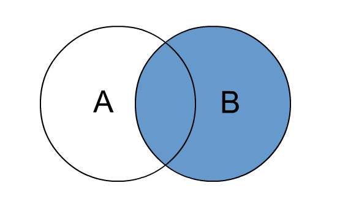

#SQL - Jointures
> Les jointures permettent d'extraire des données provenant de plusieurs tables. Le processus de normalisation du modèle relationnel est basé sur la décomposition et a pour conséquence d'augmenter le nombre de tables. Ainsi, la majorité des requêtes utilisent des jointures pour pouvoir extraire des données de tables distinctes.

Une jointure met en relation deux tables sur la base d'une **clause de jointure** (comparaison de colonnes).
Généralement, cette comparaison fait intervenir une __clé étrangère__ d'une table avec une __clé primaire__ d'une autre table.

Une jointure peut s'écrire, dans une requête SQL, de différentes manières :

#### Jointures relationnelles

```php
SELECT liste_colonnes 
FROM 
	nom_table1, 
	nom_table2
WHERE 
	condition_jointure;
```

#### Jointures SQL2

```php
SELECT liste_colonnes FROM nom_table1
[ { INNER | { LEFT | RIGHT } [ OUTER ] } ] JOIN nom_table2 ON condition_jointure;
```

#### Types de jointure supportés par MySQL

- **INNER JOIN** : retourne les enregistrements lorsqu’il y a au moins une ligne dans chaque colonne qui correspond à la condition,
- **LEFT JOIN** : retourne les enregistrements de la table de gauche (left = gauche) même s’il n’y a pas de correspondance dans la deuxième table. S'il n’y a pas de correspondance, les colonnes de la table droite vaudront toutes NULL.
- **RIGHT JOIN** : retourne tous les enregistrements de la table de droite (right = droite) même s’il n’y a pas de correspondance avec la table de gauche. S'il n’y a pas de correspondance les colonnes de la table droite vaudront toutes NULL.
- **CROSS JOIN** : retourne chaque ligne d’une table avec chaque ligne d’une autre table (produit cartésien)
- **NATURAL** : Cette jointure s’effectue à la condition qu’il y ait des colonnes du même nom et de même type dans les 2 tables. Le résultat d’une jointure naturelle est la création d’un tableau avec autant de lignes qu’il y a de paires correspondant à l’association des colonnes de même nom.
- **SELF JOIN** : correspond à une jointure d’une table avec elle-même. Ce type de requête n’est pas si commun mais très pratique dans le cas où une table lie des informations avec des enregistrements de la même table.

#### Types de jointure non supportés par MySQL

- **FULL [OUTER] JOIN** : permet de combiner les résultats des 2 tables, les associer entre eux grâce à une condition et remplir avec des valeurs NULL si la condition n’est pas respectée


## INNER JOIN 

> retourne les enregistrements lorsqu’il y a au moins une ligne dans chaque colonne qui correspond à la condition.


```php
SELECT * FROM A 
INNER JOIN B ON A.id = B.id_A;

```

## LEFT JOIN 

> retourne les enregistrements de la table de gauche (left) même s’il n’y a pas de correspondance dans la deuxième table. S'il n’y a pas de correspondance les colonnes de la table droite vaudront toutes NULL.


```php
SELECT * FROM A 
LEFT JOIN B ON A.id = B.id_A;

```

## RIGHT JOIN 

> retourne les enregistrements de la table de droite (right) même s’il n’y a pas de correspondance dans la tablende gauche. S'il n’y a pas de correspondance les colonnes de la table gauche vaudront toutes NULL.


```php
SELECT * FROM A 
RIGHT JOIN B ON A.id = B.id_A;

```